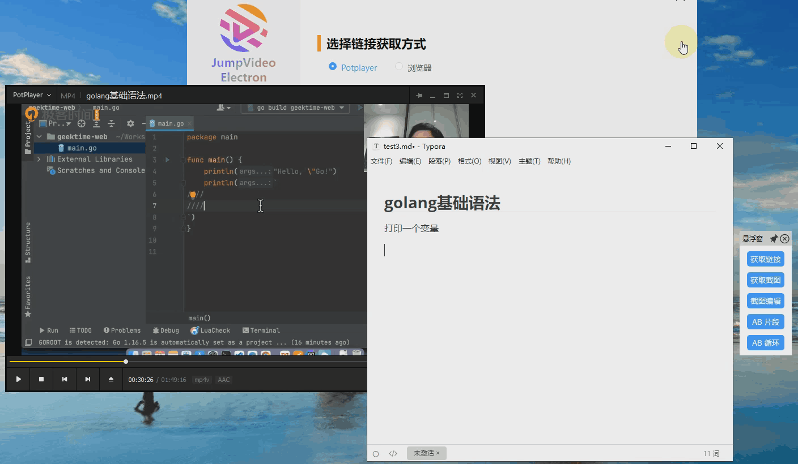
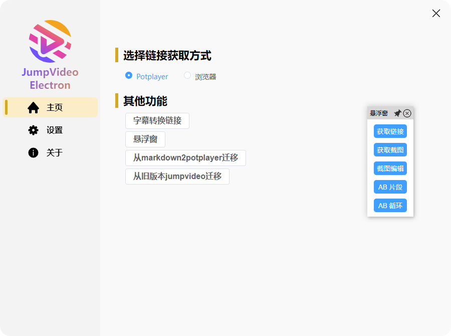
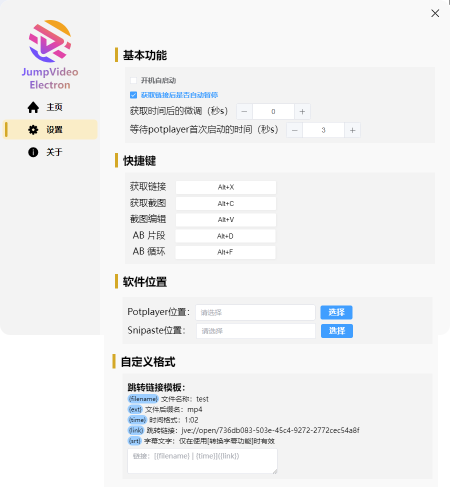
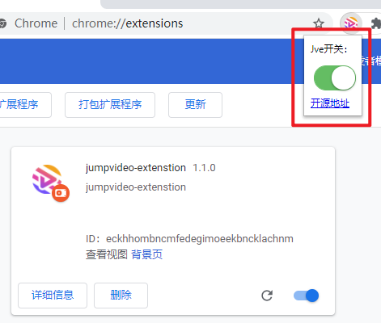
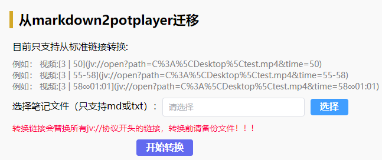
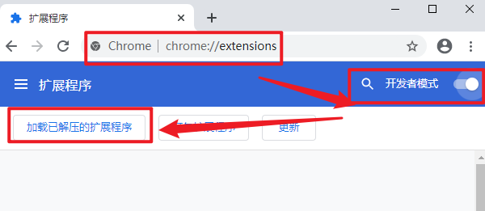
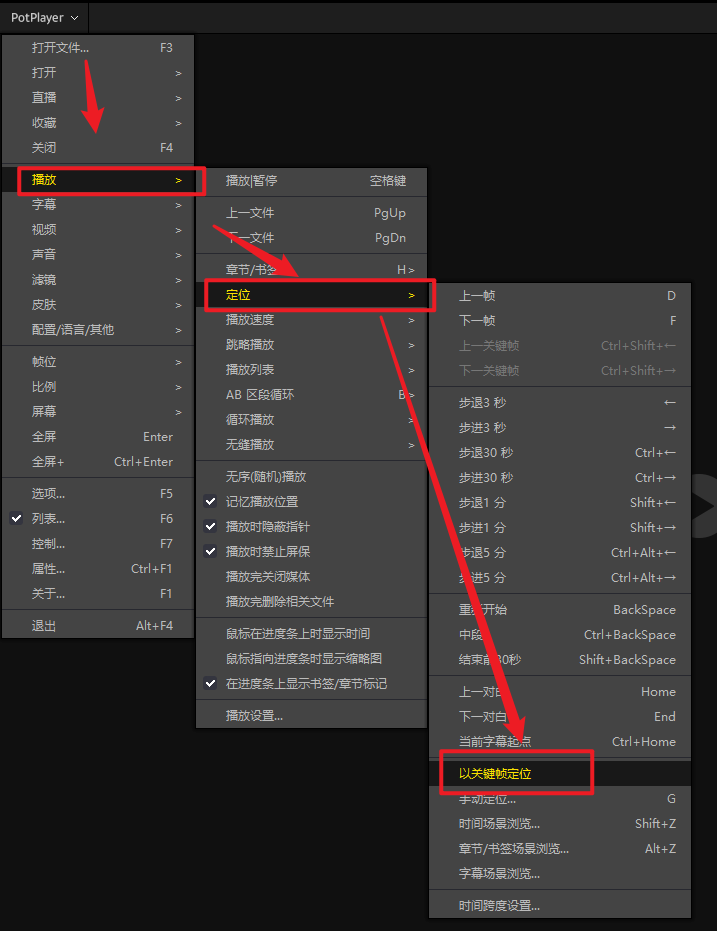

<p align="center">
  
  <h1 align="center">JumpVideo-Electron</h1>
</p>

## 项目介绍

`JumpVideo-Electron` 通过链接，实现笔记到指定视频时刻跳转，支持potplayer、浏览器网页视频作为载体。可以将视频的某个时间点生成链接，方便从笔记中点击链接直达对应的视频播放点。支持视频链接，视频截图，AB片段，AB循环。



## 项目特点

- 全功能开源，永久免费，社区驱动，无会员机制，可离线使用
- 全新架构，全新UI，全新体验
- 优雅交互，不强制光标位置，使用门槛低
- 功能全面，持续维护
- 浏览器支持chromium浏览器和火狐浏览器

## 下载地址

### 客户端下载

Github：[点击下载](https://github.com/GMYXDS/jumpvideo-electron/releases)

123云盘：https://www.123pan.com/s/4neA-a9uUH.html

### 浏览器扩展下载

Github：[点击下载](https://github.com/GMYXDS/jumpvideo-extension/releases)

123云盘：https://www.123pan.com/s/4neA-a9uUH.html

## 软件截图



<br/>



<br/>



## 功能介绍

### 获取链接

从 potplayer 或者 浏览器 获取当前的时间戳，并将链接存入剪切板

### 获取截图

从 potplayer 或者 浏览器 获取当前截图，并将链接存入剪切板

### 截图编辑

从 potplayer 或者 浏览器 获取当前截图，并调用 [Snipaste](https://www.snipaste.com/) 软件进行截图编辑。注意 [Snipaste](https://www.snipaste.com/) 软件需要提前设置位置

### AB片段

通过2次从 potplayer 或者 浏览器 获取的时间戳，组成一个时间数组，并将链接存入剪切板。从链接跳到视频之后只播放一次

### AB循环

通过2次从 potplayer 或者 浏览器 获取的时间戳，组成一个时间数组，并将链接存入剪切板。从链接跳到视频之后循环播放

如果想要关闭AB循环，potpalyer上按`\`键关闭 或者 按暂停，浏览器上按暂停

### 字幕转换链接

可以将字幕`srt`文件批量转换成对应链接，注意只支持下面格式的`srt`

```bash
0
00:00:05,320 --> 00:00:07,180
观众老爷们大家好
```


### 悬浮窗

可以打开一个全局可拖动的悬浮窗，方便用户操作，也可以通过在设置里面绑定对应的快捷键来触发对应的功能。

### 从markdown2potplayer迁移

由于本项目得到了同为开源项目[markdown2potplayer](https://github.com/livelycode36/markdown2potplayer) 作者的大力支持，方便之前使用 [markdown2potplayer](https://github.com/livelycode36/markdown2potplayer) 的用户可以通过这个功能快速迁移到 `jumpvideo-electron` 。

#### 步骤：

- 选择对应的md或者txt文件，软件会自动读取之前的跳转信息，将新生成的连接替换旧的链接，并生成一个新的`文本[处理后].md`文件
- 用户检查`文本[处理后].md`中的链接跳转没问题之后，就可以删除原版文件



### 从旧版本jumpvideo迁移

如果有使用过旧版jumpvideo的用户，可以通过这个迁移到新的 `jumpvideo-electron` 。

#### 步骤：

- 选择对应的md或者txt文件，软件会自动读取之前的跳转信息，将新生成的连接替换旧的链接，并生成一个新的`文本[处理后].md`文件
- 用户检查`文本[处理后].md`中的链接跳转没问题之后，就可以删除原版文件


### 浏览器插件使用


::: danger

当使用浏览器插件的时候，记得在软件首页设置一下链接获取的位置。需要切换到从浏览器获取，默认是从Potplayer获取。

只有当你的页面右上角显示这个图标，才表示插件在此页面正常加载了，双击可用关闭这个图标。

:::

## 补充说明

### 【跳转延迟的设置】

当从笔记中打开一个新的链接，如果此时没有启动`potplayer`或者`web浏览器`，`potplayer`的启动会消耗一定的时间，未完全启动前，无法做任何跳转。设置中的 `等待potplayer首次启动的时间（秒s）` 选项就是设置跳转的等待时间。大家可以根据自己电脑的情况进行微调。如果首次点击没有效果，可以等播放软件启动后再点击链接。

### 【部分web视频无法支持】

web浏览器上的视频跳转，目前只支持B站，百度云，腾讯视频这种有固定网址的网站。测试发现天翼，迅雷，阿里，123pan打开视频都是弹窗打开，web无法捕获具体的视频路径，无法实现跳转。

## 插件安装

1. 首先从 Github 或者 蓝奏云 下载浏览器插件的 压缩包
2. 让后将浏览器插件解压到一个固定的位置（这个文件夹不能删除, 例如解压到了test文件夹）
3. 打开Chrome浏览器，地址栏输入  `chrome://extensions/`, 勾择开发者模式，点击'加载已解压的扩展程序'
   1. 选择你刚刚.zip`文件解压所在的test文件夹，点击确定。扩展程序列表出现你导入的扩展程序即为成功。
   2. 或者直接将test文件夹拖入浏览器`chrome://extensions/`页面
4. 插件默认是关闭状态，需要手动打开



图文教程：https://docs.authing.cn/v2/guides/asa/chrome-manual-install.html

### 火狐插件安装

1. 首先从 Github 或者 123云盘 下载浏览器插件的 压缩包
2. 打开Firefox浏览器，地址栏输入`about:addons`
3. 直接将xpi格式的扩展文件拖动到浏览器里面，并点击添加
4. 插件默认是关闭状态，需要手动打开


## 推荐的流程

1. 下载客户端程序`jumpvideo-electron-1.0.0-setup.exe` 和 扩展 `jumpvideo-extension-1.0.0.zip`
2. 安装好客户端和浏览器插件【如果需要插件】
3. 点击【设置】->【软件位置】设置好potplayer 位置和snipaste位置
4. 关闭potplayer中的【选项-播放-定位-以关键帧定位】这个功能，不然跳转时间不准确
5. 开始使用跳转链接相关功能

## 未来计划

- [ ] mac兼容
- [ ] 本地播放器mpv, vlc
- [ ] 网络浏览器多平台兼容

## Q&A

### 数据存储存储在哪里？

​	软件用到了2个配置，都存在于系统用户目录，一般为：`C:\Users\<user>\AppData\Roaming`，Windows上可以通过在地址栏输入`%appdata%`快速到达

- `jve_data.db`：跳转链接数据库，存储所有跳转链接信息

- `jve_settings.json`：软件的配置信息，存储软件的配置信息，如是否开机启动等。

### 是否应该使用本软件？

1. 如果您之前由于”`JumpVideo`项目发起者风波“造成旧版`JumpVideo`无法使用，并且没有使用其他软件。我们十分感谢您的等待与支持。并且欢迎您使用这款全新架构，全新设计，全新交互并且开源的`JumpVideo-Electron`
2. 如果您已经使用其他的一些软件（免费或付费），并且其他软件已经完全满足你的需求。我们建议您不用更换。
3. 当然，如果您对开源软件比较信任，或者对全新开源的`JumpVideo-Electron`的一些设计交互比较看好，你可以尝试使用后，并选择是否迁移过来。迁移过程中有任何问题可以联系我们
4. 为了体现对开源软件的支持。我们提供了从`markdown2potplayer` 一键迁移的脚本。如果你之前使用过`markdown2potplayer`，我们建议您迁移。本项目已经覆盖`markdown2potplayer`的所有功能

### 是否支持mac？

​	虽然`JumpVideo-Electron`能够天然的跨平台，我们可以很方便的发布跨平台版本。但由于mac设备，mac适配，以及mac的使用人数，我们对此问题保持观望态度。也许在不久之后，我们开发mac的适配版本

### 是否收费？

​	本软件永远全功能开源免费。

### 为什么不能截图和链接一起粘贴？

​	功能上是可以实现的，但受限于不同笔记软件的差异。粘贴后的图片保存差异情况。目前测试了`Obsidian `和 `Typora`。发现只有`Typora`能够很好的处理图片位置问题。为了软件的统一，获取截图不再携带链接。

### 为什么potplayer时间跳转不准确？

关闭【potplayer以关键帧为定位】，位置受【选项-播放-定位-以关键帧定位】关掉此选项。则跳转时间非常精准




## 反馈

- 您可以通过关于里面的群聊，加群反馈。
- 或者进入项目 [Github](https://github.com/GMYXDS/jumpvideo-electron) 提相关 [Issue](https://github.com/GMYXDS/jumpvideo-electron/issues)。

## 致谢

感谢 [livelycode36](https://github.com/livelycode36/) 在开发过程中给予的帮助与建议！

## 补充项目背景

- [原项目发起者说法](https://www.bilibili.com/video/BV1Px4y1Q7is)
- [原主程序说法](https://www.yuque.com/zhangyewuxianxiaozhang/er8rsh/huntnk8a9me4iegn)

在B站关注到有关视频之后，软件看起来也不是很复杂。在和原项目发起者进行沟通后，决定写一款开源的`JumpVideo`，即本项目。

## 社区共建

欢迎各位大佬issue，pr，共同完善这个项目

- 主程序主要由 [Electron](https://www.electronjs.org/) 技术完成，脚手架用的 [electron-vite](https://electron-vite.org/) 里面主要涉及了 nodejs，vue3，electron框架等技术，还包括一些业务细节，如nodejs调用dll，potplayer和windows的消息通信，sqlite3，注册表，快捷键，shell调用等。
- 项目的插件主要涉及到插件的开发，你可能需要了解一些插件的基本开发知识，以及websocket的使用，包括chrome浏览器插件和火狐浏览器插件
- 文档主要使用 [vitepress](https://vitepress.dev/) 写的

[主程序](https://github.com/GMYXDS/jumpvideo-electron)  [浏览器插件](https://github.com/GMYXDS/jumpvideo-extension) [文档](https://github.com/GMYXDS/jumpvideo-electron-doc)

## 运行此项目

### 安装

```bash
$ npm install
```

### 开发

```bash
$ npm run dev
```

### 构建

```bash
# For windows
$ npm run build:win

# For macOS
$ npm run build:mac

# For Linux
$ npm run build:linux
```
